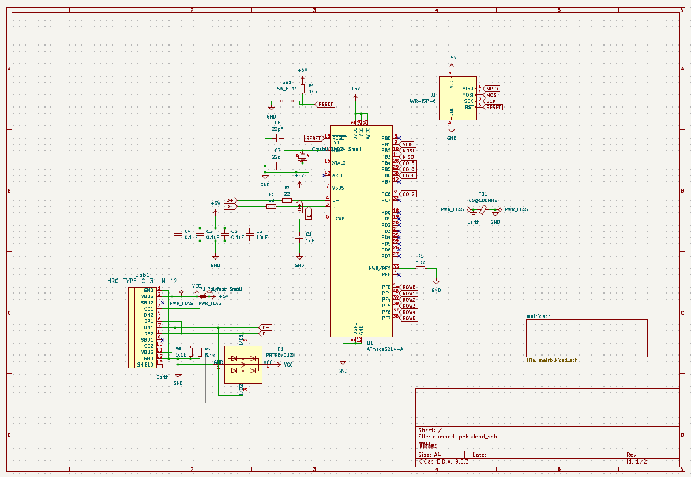

# 6x4 USB-C Numpad PCB
A PCB for a 6x4 numpad with a row for four customizable macros. Uses Alps switch footprints and a USB-C connection. Designed in Kicad.    

TBA: an image of the final PCB in person! :-)   
    
TBA: link to firmware repository   

# The Design
_A schematic of the MCU connections._  

_A schematic of the matrix of switch connections._    
   

_The front traces of the PCB._      
     

_The back traces of the PCB._      
     

# How It Was Made
**Software:** Kicad EDA v9.03  
**Manufacturer:** TBA  
This numpad uses the following bill of materials:    
| Designation | Type                   | Footprint | Quantity |
|-------------|------------------------|-----------|----------|
| FB1         | Ferrite Bead           | 0805      | 1        |
| SW1         | Reset switch           | SKQG      | 1        |
| SW2-SW23    | Reset switch           | ALPS      | 22       |
| C1-C4       | 100nF Capacitor        | 0805      | 4        |
| C5          | 10uF Capacitor         | 0805      | 1        |
| C6          | 1uF Capacitor          | 0805      | 1        |
| C7, C8      | 22pF Capacitor         | 0805      | 2        |
| R1, R2      | 10kΩ Resistor          | 0805      | 2        |
| R3, R4      | 22Ω Resistor           | 0805      | 2        |
| R5, R6      | 5.1kΩ Resistor         | 0805      | 2        |
| X1          | 16 MHz Crystal         | 3225      | 1        |
| USB1        | USB Connector          | HRO-TYPE-C-31-M-12 | 1  |
| U2          | PRTR5V0U2X             | SOT143B   | 1        |
| U1          | Atmega 32U4-AU         | TQFP-44   | 1        |
| F1          | PTC Fuse               | 1206      | 1        |
| D1-D23      | Diode                  | SOD-123   | 23       |      
   
The 3D modeling software Blender has many shortcuts that are only accessable using numpad shortcuts. Although these features are also accessable on Blender's UI, these shortcuts greatly accelerate the modeling process. However, my partner's keyboard is 65% and lacks a numpad. I wanted to design him a numpad that could solve this problem while using the keycaps and Alps switches he currently had. I also wanted to design the numpad with USB-C conectivity and a 4-key macro row for any additional shortcuts.  
  
To make the numpad, I followed [Masterzen's tutorial](https://www.masterzen.fr/2020/05/03/designing-a-keyboard-part-1/) on designing a PCB for a keyboard. This was my first time designing a PCB and using software like Kicad. I initially struggled with laying out the components on the PCB. I learned a lot of new information about why PCB components are laid out in specific ways and how to handle signals with minimal noise. I also learned about the importance of impedance on especially delicate routes such as the USB-C's D+/D- differential pair. In the future, I would like to optimize routing as much as possible with minimal vias. The amount of traces and their angles around the MCU are somewhat difficult to read and has the potential to create too much noise around the critical differential pairs. Since this is a low-speed numpad, this will most likely not be an issue, but I want to prioritize reliable PCB design moving forward.
      
_The PCB as viewed in the 3D viewer._      
     

# To Do
This PCB is still in progress. The next steps are:  
1. Order PCB board and its components. 
2. Program the firmware using [QMK](https://github.com/qmk/qmk_firmware). 
3. Model a chassis for the numpad in Solidworks. 
4. Create a main repository where the final design is kept. 

# How to Build
If you want to build the numpad yourself, you can order the parts following the links on the bill of materials table above! You can also use the same manufacturer, or the following Kicad-recommended manufacturers:  
* [Alsier (US)](https://aisler.net/)
* [OSHPark (US)](https://docs.oshpark.com/design-tools/kicad/generating-kicad-gerbers/)
* [PCBWay (China)](https://www.pcbway.com/blog/help_center/Generate_Gerber_file_from_Kicad.html)

PS: Thank you (bf's github user)!